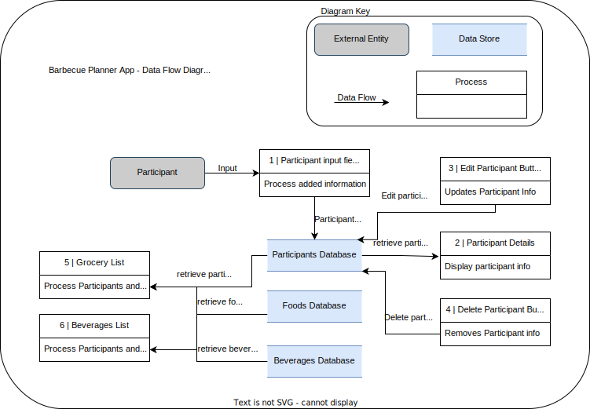
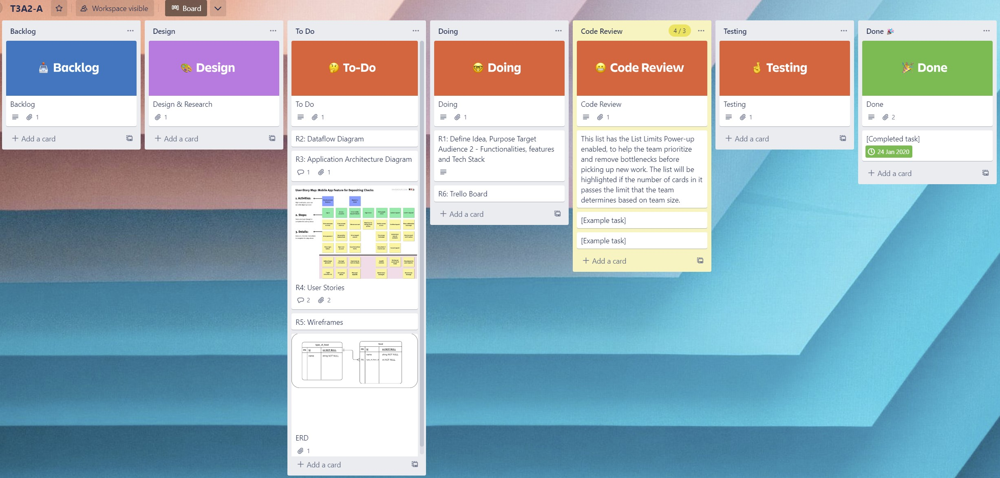
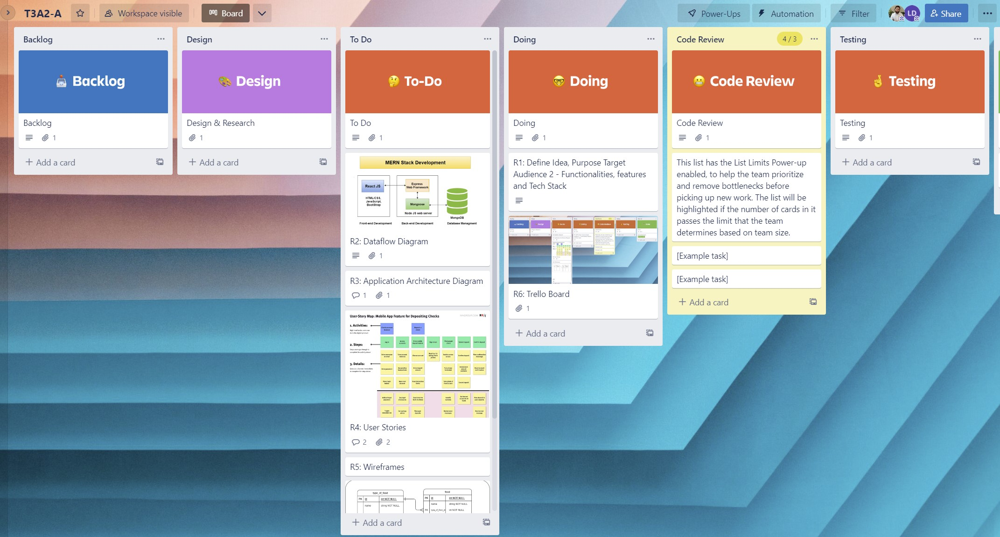
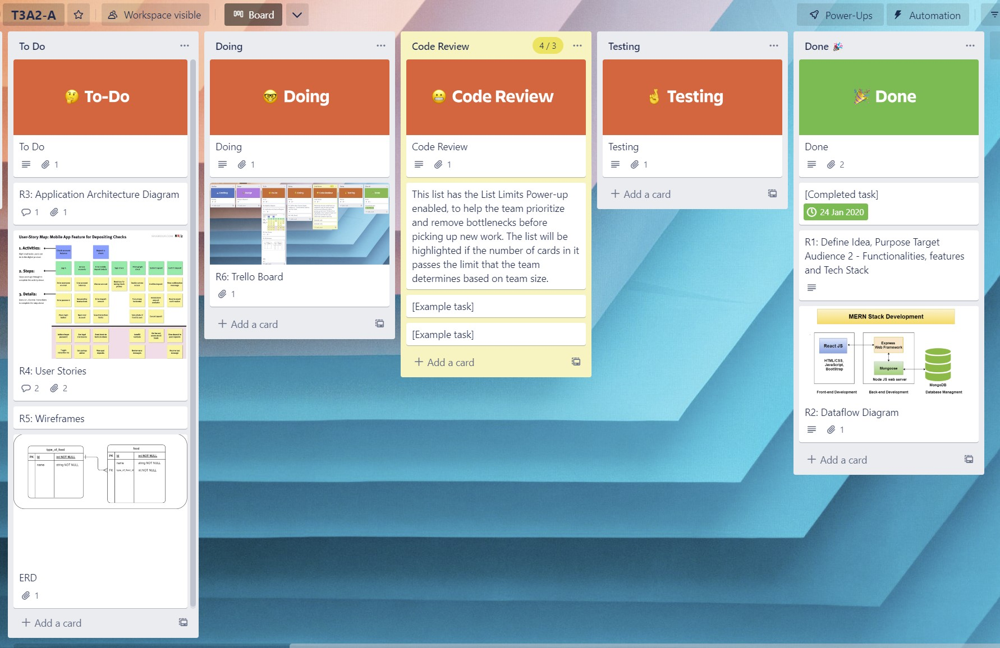

# **GusCosta_T3A2_A**

# **Table of contents:**

- [**Table of contents**](#table-of-contents)
    - [**R1 - Description of your website, including:**](#r1---description-of-your-website-including)

    - [**R2 - Dataflow Diagram:**](#r2---dataflow-diagram)

    - [**R3 - Application Architecture Diagram:**](#r3---application-architecture-diagram)

    - [**R4 - User Stories:**](#r4---user-stories)

    - [**R5 - Wireframes for multiple standard screen sizes, created using industry standard software:**](#r5---wireframes-for-multiple-standard-screen-sizes-created-using-industry-standard-software)

    - [**R6 - Screenshots of your Trello board throughout the duration of the project:**](#r6---screenshots-of-your-trello-board-throughout-the-duration-of-the-project)

## **R1 - Description of your website, including:**
- **Purpose**
    
    The main purpose of the Barbecue planner APP is to provide a solution to help with the quantities of food needed to perform a successful Barbecue with no waste and properly feeding everyone present considering each individual, their preferences and dietarian restricions.
    
    Problems this app solves:
    - Reduces food waste.
    - Considers each individual's preferences and food restrictions.
    - It facilitates planning.

- **Functionality / features**
    - Add people to the event's list.
    - Select specific types of drinks for each person.
    - Select options of preferences and Dietary restrictions.
    - Select Foods from a default items list containing items like salad, meats,  sausages, bread, rice, vegetarian options, etc.
    - Select Drinks from a default items list containing items like, beer, wine, softdrink, juice, etc.

    The app returns a shopping list with items and quantities.
    The app returns a list of people.

- **Target audience**

    - An individual who wants to entertain family and friends performing a barbecue.
    - A company organizing an event for its workers.
    - A professional chef or restaurant owner serving barbecue.

- **Tech stack:**
    - Deployment: Railway
    - Database: MongoDB
    - Back-end: Mongoose, Express, NodeJS
    - Frontend: React, Bootstrap
    
    - A general overview on how a MERN (MongoDB, Express, React, Node) stack works to get a better understanding on how it will be applied on this app. The application receives new data from the user or displays data retrieved from the database using React, This data passes through a web framework called Express that handles routes using Node and is then processed in a Middleware ODM (Object Data Modeling) library called Mongoose that serves JSON data to the MongoDB database, see image bellow.
    
    

    [how-does-the-mern-stack-work](https://www.bocasay.com/how-does-the-mern-stack-work/)
    

## **R2 - Dataflow Diagram:**

- The Data flow diagram process chosen for this application is known as Gane & Sarson and it is commonly used for information systems. On the Barbecue Planner App the dataflow will start by an external entity called participant, the participant info is processed and added to the participants database, this data is retrieved from the database and displayed on the app, the user can also choose to edit or delete this information, the grocery list and the drinks list retrieves data from the participants database as well as from the default entered items in the drinks and foods database, process the data and it displays it.

    

    -The ERD (Entity Relationship Diagram) Bellow represents the tables and items in the database and how they interact, so we can have a clearer understanding of which of these data is being retrieved and processed in the dataflow diagram. 

    

    

    [Dataflow Diagram](https://www.lucidchart.com/pages/data-flow-diagram/how-to-make-a-dfd)

## **R3 - Application Architecture Diagram:**

- Answer

    

    [sample reference](referenceURL)

## **R4 - User Stories:**

- Answer

    

    [sample reference](referenceURL)

## **R5 - Wireframes for multiple standard screen sizes, created using industry standard software:**

- Answer

    

    [sample reference](referenceURL)

## **R6 - Screenshots of your Trello board throughout the duration of the project:**

- Answer

    

    

    

    [Trello Board Link](https://trello.com/b/rLoXMfdJ/t3a2-a)
    